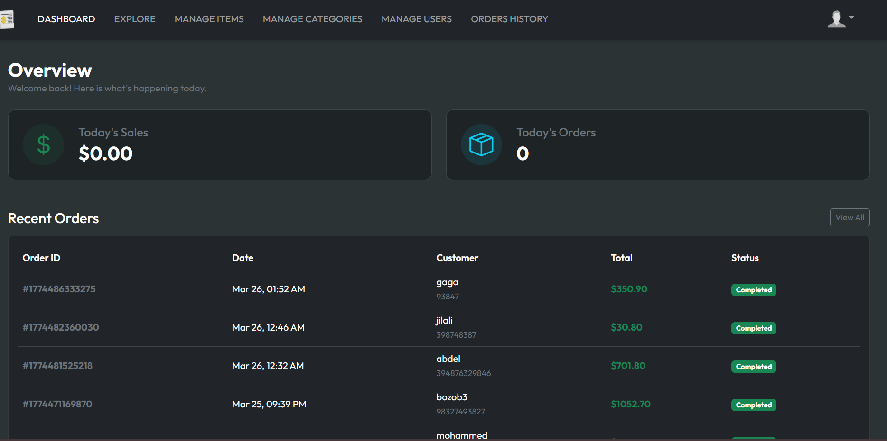
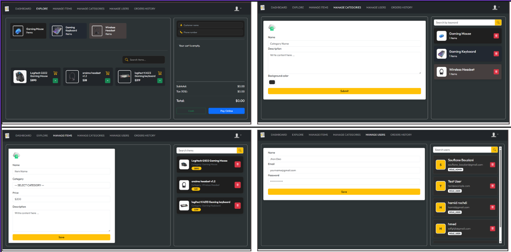
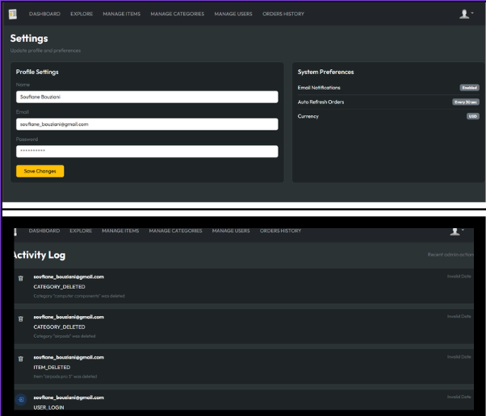

# BillingSoftware 💸


BillingSoftware is a full-stack Point-of-Sale (POS) and billing management system designed for small businesses and retail shops. Built with Spring Boot and React, it features role-based access: admins manage categories, items, users, and view activity logs, while regular users can explore items, create orders, process payments via Stripe, generate PDF receipts, and view dashboard analytics. Protected endpoints ensure secure access to administrative functions.

## ✨ Features

- **Role-Based Access** 🔒: Admins manage categories, items, and users; users explore, order, and pay.
- **Category & Item Management** 📋: Admins can add or delete categories and items with image uploads.
- **Point of Sale** 🛒: Browse products by category, add to cart, and create orders with customer details.
- **Payment Integration** 💳: Process payments securely with Stripe Checkout.
- **PDF Receipts** 📄: Generate and download professional PDF receipts for orders.
- **Dashboard** 📊: View today's sales summary, order count, and recent orders.
- **Activity Logging** 📝: Audit trail of user actions for admin monitoring.
- **Image Storage** 🖼️: Upload and store product images using MinIO (S3-compatible storage).
- **Responsive Interface** 🎨: Seamless experience across devices with React and Bootstrap.

## 📸 Screenshots





## 🧠 Architecture Highlights

As a developer, I focused heavily on writing clean, scalable, and secure code:
- **Layered Architecture:** Strict separation of concerns between Controllers, Services, and Repositories.
- **Data Protection (DTOs):** Raw database entities are *never* exposed to the frontend. I implemented Request and Response Data Transfer Objects (DTOs) to secure sensitive data.
- **Zero-Trust Security:** Used Spring Security's `SecurityContextHolder` to securely extract the logged-in user's identity for Activity Logging, rather than trusting frontend payload data.
- **Robust Error Handling:** Wrapped critical non-blocking operations (like background logging) in `try-catch` blocks to ensure the main checkout flow never crashes for the user.

## 🛠️ Tech Stack

- **Frontend**: React 19 ⚛️, Vite 🚀, Bootstrap 5 🎨, React Router DOM, Axios
- **Backend**: Spring Boot 4.0.2 🌱, Java 21 ☕, Spring Security, Lombok 🛠️
- **Database**: MySQL 8.0 🗄️
- **File Storage**: MinIO (S3-compatible) 📦
- **Payment Gateway**: Stripe 💳
- **PDF Generation**: OpenPDF 📄
- **DevOps**: Docker Compose 🐳, Maven 📦

## 📋 Entities

**Note**: Categories and Items are managed by admins and not directly accessible to users via API for write operations.

- **User** 👤
  - `id`: Unique identifier (Long)
  - `email`: User email (String)
  - `password`: Password (String, hashed with BCrypt)
  - `name`: Display name (String)
  - `role`: User role (Enum: ADMIN, USER)

- **Category** 📋
  - `id`: Unique identifier (Long)
  - `name`: Category name (String)
  - `description`: Category description (String)
  - `bgColor`: Background color for UI (String)
  - `imgUrl`: Category image URL (String)
  - Relationships: One-to-Many with `Items`

- **Item** 📦
  - `id`: Unique identifier (Long)
  - `name`: Item name (String)
  - `price`: Item price (Double)
  - `description`: Item description (String)
  - `imgUrl`: Item image URL (String)
  - `categoryId`: Reference to Category (Long)
  - Relationships: Many-to-One with `Category`

- **Order** 🛒
  - `id`: Unique identifier (Long)
  - `customerName`: Customer name (String)
  - `customerPhone`: Customer phone (String)
  - `subTotal`: Subtotal amount (Double)
  - `tax`: Tax amount (Double)
  - `total`: Total amount (Double)
  - `paymentMethod`: Payment method (CASH, UPI, CARD)
  - `paymentStatus`: Status (PENDING, COMPLETED)
  - `createdAt`: Order creation date (LocalDateTime)
  - Relationships: One-to-Many with `OrderItem`

- **OrderItem** 📋
  - `id`: Unique identifier (Long)
  - `name`: Item name (String)
  - `price`: Item price (Double)
  - `quantity`: Item quantity (Integer)
  - Relationships: Many-to-One with `Order`

- **ActivityLog** 📝
  - `id`: Unique identifier (Long)
  - `action`: Action performed (String)
  - `performedBy`: User who performed the action (String)
  - `timestamp`: When the action occurred (LocalDateTime)

## 🌐 API Endpoints

Base URL: `/api/v1.0`

| **Method** | **Endpoint**                       | **Description**                        | **Access**            |
|------------|------------------------------------|----------------------------------------|-----------------------|
| POST       | `/login`                           | Authenticate a user                    | Public                |
| GET        | `/categories`                      | Retrieve all categories                | Authenticated users   |
| POST       | `/admin/categories`                | Create a new category (with image)     | Admin only            |
| DELETE     | `/admin/categories/{id}`           | Delete category by ID                  | Admin only            |
| GET        | `/items`                           | Retrieve all items                     | Authenticated users   |
| POST       | `/admin/items`                     | Create a new item (with image)         | Admin only            |
| DELETE     | `/admin/{itemId}`                  | Delete item by ID                      | Admin only            |
| POST       | `/orders`                          | Create a new order                     | Authenticated users   |
| GET        | `/orders/latest`                   | Get all orders                         | Authenticated users   |
| DELETE     | `/orders/{orderId}`                | Delete order by ID                     | Authenticated users   |
| POST       | `/payments/create`                 | Create Stripe checkout session         | Authenticated users   |
| POST       | `/payments/verify`                 | Verify Stripe payment                  | Authenticated users   |
| GET        | `/payments/receipt/{orderId}`      | Download PDF receipt                   | Authenticated users   |
| GET        | `/dashboard`                       | Get dashboard analytics                | Authenticated users   |
| POST       | `/admin/register`                  | Register a new user                    | Admin only            |
| GET        | `/admin/users`                     | Get all users                          | Admin only            |
| DELETE     | `/admin/users/{id}`                | Delete a user by ID                    | Admin only            |
| GET        | `/profile`                         | Get current user profile               | Authenticated users   |
| PUT        | `/profile`                         | Update user profile                    | Authenticated users   |
| GET        | `/activity-logs`                   | Get all activity logs                  | Admin only            |

## 🎮 Usage

### For Admins
- **Manage Categories** 📋: Add or delete categories with images and background colors via the admin panel.
- **Manage Items** 📦: Add or delete items under categories with pricing and images.
- **Create Users** 👤: Register new users with assigned roles.
- **Delete Users** 🚫: Remove users as needed.
- **View Activity Logs** 📝: Monitor user actions and system activity.

### For Users
- **Login** 🔑: Authenticate using email and password to access the application.
- **Dashboard** 📊: View today's sales summary, order count, and recent orders.
- **Explore Page** 🔍: Browse categories and items, add to cart, and create orders.
- **Process Payment** 💳: Pay for orders via Stripe Checkout or select Cash/UPI.
- **Download Receipts** 📄: Generate and download PDF receipts for completed orders.
- **View Order History** 📜: Check all past orders and their details.
- **Profile Settings** ⚙️: View and update your profile information.

## 🚀 Installation

Follow these steps to set up the project locally:

1. **Prerequisites**:
   - Java 21+ ☕
   - Node.js 18+ 📦
   - Docker & Docker Compose 🐳
   - Maven 📦

2. **Clone the Repository**:
   ```bash
   git clone https://github.com/yourusername/BillingSoftware.git
   cd BillingSoftware
   ```

3. **Start Docker Services** (MySQL & MinIO):
   ```bash
   cd billingsoftwar
   docker-compose up -d
   ```
   This starts:
   - MySQL on port `3306`
   - MinIO API on port `9000`, Console on port `9001`

4. **Set Up the Backend**:
   - Navigate to the backend directory:
     ```bash
     cd billingsoftwar
     ```
   - Configure `src/main/resources/application.properties`:
     ```properties
     spring.datasource.url=jdbc:mysql://localhost:3306/billing_app
     spring.datasource.username=root
     spring.datasource.password=your_password
     spring.jpa.hibernate.ddl-auto=update

     # Stripe Configuration
     stripe.api.key=your_stripe_secret_key

     # MinIO Configuration
     aws.accessKeyId=your_minio_access_key
     aws.secretKey=your_minio_secret_key
     aws.region=us-east-1
     aws.bucket.name=billing
     aws.s3.endpoint=http://localhost:9000

     # JWT Configuration
     jwt.secret.key=your_jwt_secret_key
     ```
   - Build and run the Spring Boot application:
     ```bash
     ./mvnw clean install
     ./mvnw spring-boot:run
     ```

5. **Set Up the Frontend**:
   - Navigate to the frontend directory:
     ```bash
     cd client
     ```
   - Install dependencies and start the React app:
     ```bash
     npm install
     npm run dev
     ```

6. **Access the Application**:
   - Frontend: `http://localhost:5173`
   - Backend API: `http://localhost:8080/api/v1.0`
   - MinIO Console: `http://localhost:9001`

## 💳 Payment Flow (Stripe)

1. User places order from the Explore page.
2. Backend creates order and Stripe Checkout session.
3. Frontend redirects user to Stripe checkout URL.
4. On success, frontend calls payment verification endpoint.
5. Backend verifies session with Stripe and marks order as completed.
6. Completed orders can generate/download PDF receipts.

## 🏗️ Project Structure

- **Backend** (`billingsoftwar/`):
  - `config/`: Security and AWS configurations
  - `controller/`: REST API controllers
  - `entity/`: JPA entities (User, Category, Item, Order, etc.)
  - `io/`: Request/Response DTOs
  - `repositry/`: Spring Data JPA repositories
  - `service/`: Business logic and service layers
  - `filters/`: JWT authentication filter
  - `util/`: JWT utilities
  - Uses Lombok to reduce boilerplate code

- **Frontend** (`client/`):
  - `components/`: Reusable UI components (Header, ProtectedRoute, etc.)
  - `context/`: React Context for global state management
  - `pages/`: Application pages (Dashboard, Explore, Orders, etc.)
  - `service/`: API service calls with Axios
  - `utils/`: Utility functions
  - Bootstrap 5 for styling

## 🐳 Docker Services

The `docker-compose.yml` includes:
- **MySQL 8.0** 🗄️: Database server (port 3306)
- **MinIO** 📦: S3-compatible object storage (API: 9000, Console: 9001)

## 🔒 Security Notes

- JWT-based stateless authentication with 10-hour token expiration.
- BCrypt password encryption.
- Role-based access control (ADMIN, USER).
- Activity Log API restricted to Admin users.
- CORS configured for frontend development server.

## 🤝 Contributing

Contributions are welcome! To contribute:

1. Fork the repository 🍴.
2. Create a new branch (`git checkout -b feature/your-feature`).
3. Make your changes and commit (`git commit -m "Add your feature"`).
4. Push to the branch (`git push origin feature/your-feature`).
5. Open a pull request 📥.

Please ensure your code adheres to the project's coding standards and includes tests.

## 📜 License

This project is licensed under the [MIT License](LICENSE).

## 📬 Contact

For questions or feedback, open an issue on this repository.

---

Happy billing! 🎉
